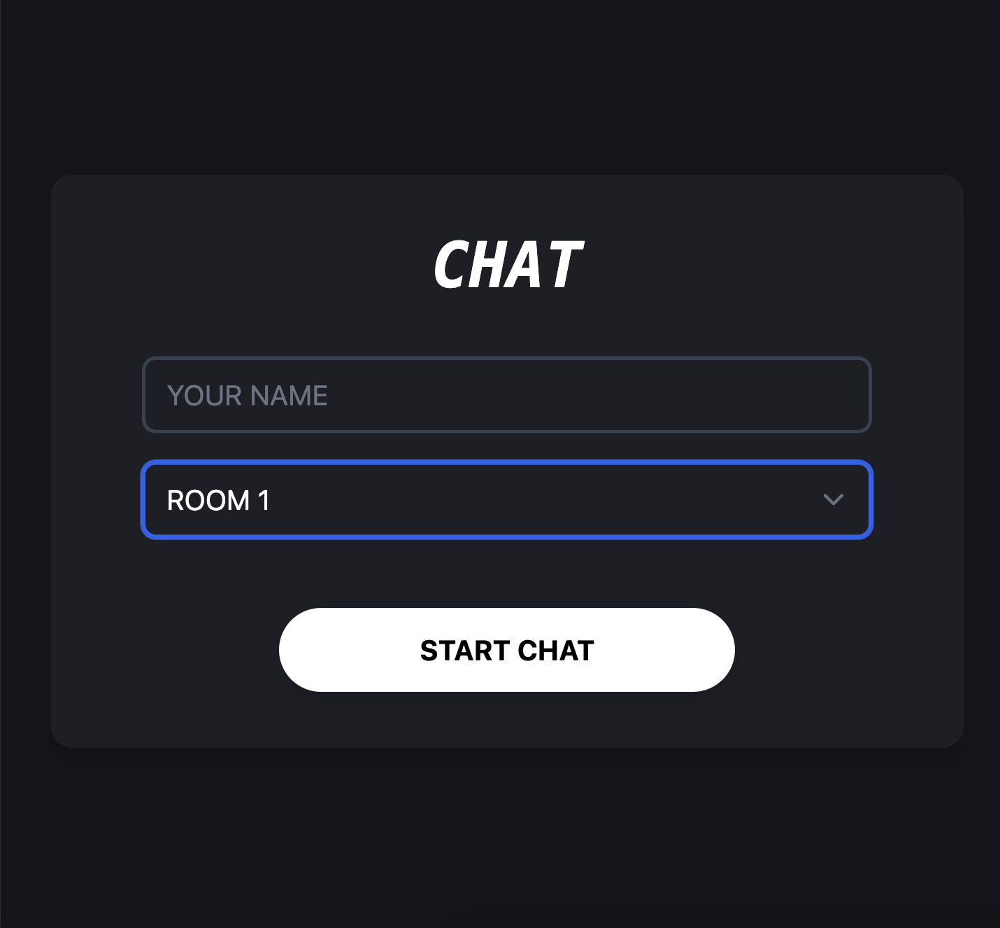

# 💬 Chat Application

This is a lightweight real-time chat application built with Node.js and Express. It demonstrates a full-stack web development workflow using vanilla JavaScript on the front end and socket-based messaging on the back end. The project is designed as a personal learning initiative to explore the fundamentals of web sockets, real-time communication, and full-stack integration.

## 🧠 Motivation

This project was developed as part of my portfolio to showcase my ability to:

- Build and structure a full-stack application from scratch
- Implement real-time communication via WebSockets (Socket.IO)
- Work with server-client architecture and RESTful routing
- Apply best practices in backend development with Express


## 🚀 Features

- Real-time multi-user chat
- Clean and responsive front-end UI
- Room-based conversation architecture (extendable)
- Simple nickname support (can be extended with login)
- Modular routing for scalability


## 📁 Project Structure


## 🛠️ Tech Stack

A modular full-stack chat system built using modern JavaScript tooling, designed to demonstrate real-time web capabilities.

| Layer               | Technology             | Description |
|---------------------|------------------------|-------------|
| **Frontend**        | HTML, CSS, JavaScript  | Builds the user interface and handles basic interactions |
| **Templating**      | EJS                    | Server-side rendering of dynamic HTML content |
| **Backend**         | Node.js, Express       | Handles routing, session logic, and middleware configuration |
| **Real-time Engine**| Socket.IO              | Enables bi-directional WebSocket-based communication |
| **Dev Utilities**   | nodemon, dotenv        | Improves development workflow and manages environment variables |


## 🧪 Setup & Run Locally
```bash
   webpack_version 5.39.1
   Node.js：17+ 
   package.json "dev" : "cross-env NODE_OPTIONS=--openssl-legacy-provider NODE_ENV=development nodemon ./src/index.ts"
```

1. **Clone the repository**
   ```bash
   git clone https://github.com/lukerspace/TypescriptChatroom.git
   cd TypescriptChatroom


2. **Npm compile to run server**
   ```bash
   npm run dev

3. **Open localhost new browser**
   ```bash
   127.0.0.1:3000





